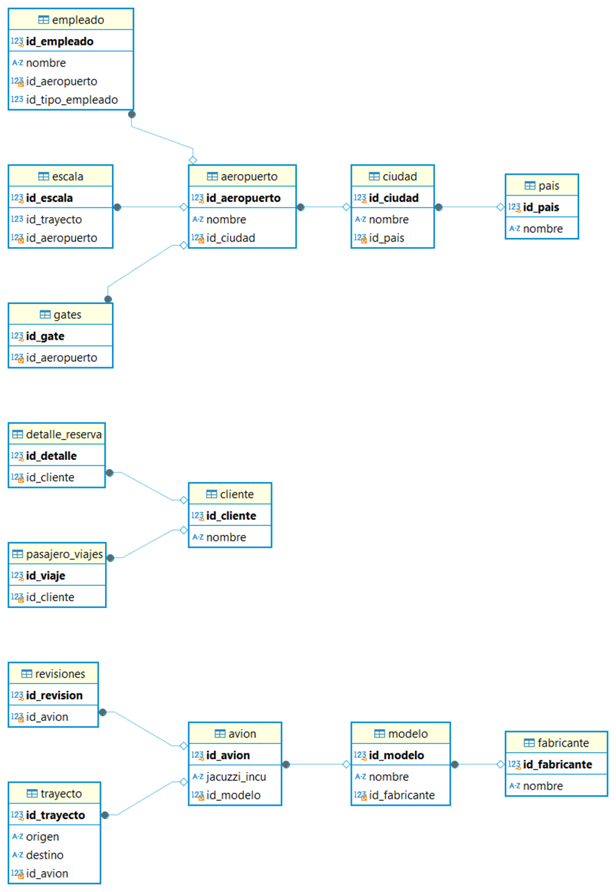

Entidades principales

pais
ciudad
sucursal
cliente
proveedor
producto
pedido
factura
detallefactura
empleado
inventario
stock
compra
venta

Relaciones

pais (1) a (N) ciudad
ciudad (1) a (N) sucursal
ciudad (1) a (N) cliente
ciudad (1) a (N) proveedor
sucursal (1) a (N) empleado
sucursal (1) a (N) inventario
sucursal (1) a (N) pedido
sucursal (1) a (N) factura
cliente (1) a (N) factura
cliente (1) a (N) venta
proveedor (1) a (N) pedido
pedido (1) a (1) compra
factura (1) a (N) detallefactura
producto (1) a (N) detallefactura
inventario (1) a (N) stock
producto (1) a (N) stock

Modelo fisico

CREATE TABLE `ciudad` (
  `id_ciudad` int NOT NULL AUTO_INCREMENT,
  `nombre_ciudad` varchar(100) NOT NULL,
  `id_pais` int DEFAULT NULL,
  PRIMARY KEY (`id_ciudad`),
  KEY `fk_ciudad_pais` (`id_pais`),
  CONSTRAINT `fk_ciudad_pais` FOREIGN KEY (`id_pais`) REFERENCES `pais` (`id_pais`)
)

CREATE TABLE `cliente` (
  `id_cliente` int NOT NULL AUTO_INCREMENT,
  `nombre_cliente` varchar(100) NOT NULL,
  `email` varchar(100) DEFAULT NULL,
  `telefono` varchar(15) DEFAULT NULL,
  `direccion` varchar(255) DEFAULT NULL,
  `id_ciudad` int DEFAULT NULL,
  `id_pais` int DEFAULT NULL,
  PRIMARY KEY (`id_cliente`),
  KEY `fk_cliente_ciudad` (`id_ciudad`),
  KEY `fk_cliente_pais` (`id_pais`),
  CONSTRAINT `fk_cliente_ciudad` FOREIGN KEY (`id_ciudad`) REFERENCES `ciudad` (`id_ciudad`),
  CONSTRAINT `fk_cliente_pais` FOREIGN KEY (`id_pais`) REFERENCES `pais` (`id_pais`)
)

CREATE TABLE `compra` (
  `id_compra` int NOT NULL AUTO_INCREMENT,
  `id_pedido` int DEFAULT NULL,
  `fecha_compra` date DEFAULT NULL,
  `monto_total` decimal(10,2) DEFAULT NULL,
  `estado_compra` varchar(50) DEFAULT NULL,
  PRIMARY KEY (`id_compra`),
  KEY `fk_compra_pedido` (`id_pedido`),
  CONSTRAINT `fk_compra_pedido` FOREIGN KEY (`id_pedido`) REFERENCES `pedido` (`id_pedido`)
)

CREATE TABLE `detallefactura` (
  `id_detalle` int NOT NULL AUTO_INCREMENT,
  `id_factura` int DEFAULT NULL,
  `id_producto` int DEFAULT NULL,
  `cantidad` int DEFAULT NULL,
  `precio_unitario` decimal(10,2) DEFAULT NULL,
  `subtotal` decimal(10,2) DEFAULT NULL,
  PRIMARY KEY (`id_detalle`),
  KEY `fk_detalle_factura` (`id_factura`),
  KEY `fk_detalle_producto` (`id_producto`),
  CONSTRAINT `fk_detalle_factura` FOREIGN KEY (`id_factura`) REFERENCES `factura` (`id_factura`),
  CONSTRAINT `fk_detalle_producto` FOREIGN KEY (`id_producto`) REFERENCES `producto` (`id_producto`)
) 

CREATE TABLE `empleado` (
  `id_empleado` int NOT NULL AUTO_INCREMENT,
  `nombre_empleado` varchar(100) NOT NULL,
  `cargo` varchar(100) DEFAULT NULL,
  `id_sucursal` int DEFAULT NULL,
  PRIMARY KEY (`id_empleado`),
  KEY `fk_empleado_sucursal` (`id_sucursal`),
  CONSTRAINT `fk_empleado_sucursal` FOREIGN KEY (`id_sucursal`) REFERENCES `sucursal` (`id_sucursal`)
) 

CREATE TABLE `factura` (
  `id_factura` int NOT NULL AUTO_INCREMENT,
  `id_cliente` int DEFAULT NULL,
  `id_sucursal` int DEFAULT NULL,
  `fecha_factura` date DEFAULT NULL,
  `total_factura` decimal(10,2) DEFAULT NULL,
  PRIMARY KEY (`id_factura`),
  KEY `fk_factura_cliente` (`id_cliente`),
  KEY `fk_factura_sucursal` (`id_sucursal`),
  CONSTRAINT `fk_factura_cliente` FOREIGN KEY (`id_cliente`) REFERENCES `cliente` (`id_cliente`),
  CONSTRAINT `fk_factura_sucursal` FOREIGN KEY (`id_sucursal`) REFERENCES `sucursal` (`id_sucursal`)
)

CREATE TABLE `inventario` (
  `id_inventario` int NOT NULL AUTO_INCREMENT,
  `id_sucursal` int DEFAULT NULL,
  `fecha_actualizacion` date DEFAULT NULL,
  `estado_inventario` varchar(50) DEFAULT NULL,
  PRIMARY KEY (`id_inventario`),
  KEY `fk_inventario_sucursal` (`id_sucursal`),
  CONSTRAINT `fk_inventario_sucursal` FOREIGN KEY (`id_sucursal`) REFERENCES `sucursal` (`id_sucursal`)
)

CREATE TABLE `pais` (
  `id_pais` int NOT NULL AUTO_INCREMENT,
  `nombre_pais` varchar(100) NOT NULL,
  PRIMARY KEY (`id_pais`)
)

CREATE TABLE `pedido` (
  `id_pedido` int NOT NULL AUTO_INCREMENT,
  `id_proveedor` int DEFAULT NULL,
  `id_sucursal` int DEFAULT NULL,
  `fecha_pedido` date DEFAULT NULL,
  `estado_pedido` varchar(50) DEFAULT NULL,
  PRIMARY KEY (`id_pedido`),
  KEY `fk_pedido_proveedor` (`id_proveedor`),
  KEY `fk_pedido_sucursal` (`id_sucursal`),
  CONSTRAINT `fk_pedido_proveedor` FOREIGN KEY (`id_proveedor`) REFERENCES `proveedor` (`id_proveedor`),
  CONSTRAINT `fk_pedido_sucursal` FOREIGN KEY (`id_sucursal`) REFERENCES `sucursal` (`id_sucursal`)
) 

CREATE TABLE `producto` (
  `id_producto` int NOT NULL AUTO_INCREMENT,
  `nombre_producto` varchar(100) NOT NULL,
  `tipo_producto` enum('Bicicleta','Repuesto') NOT NULL,
  `precio` decimal(10,2) DEFAULT NULL,
  `descripcion` text,
  PRIMARY KEY (`id_producto`)
)

CREATE TABLE `proveedor` (
  `id_proveedor` int NOT NULL AUTO_INCREMENT,
  `nombre_proveedor` varchar(100) NOT NULL,
  `telefono` varchar(15) DEFAULT NULL,
  `email` varchar(100) DEFAULT NULL,
  `direccion` varchar(255) DEFAULT NULL,
  `id_ciudad` int DEFAULT NULL,
  `id_pais` int DEFAULT NULL,
  PRIMARY KEY (`id_proveedor`),
  KEY `fk_proveedor_ciudad` (`id_ciudad`),
  KEY `fk_proveedor_pais` (`id_pais`),
  CONSTRAINT `fk_proveedor_ciudad` FOREIGN KEY (`id_ciudad`) REFERENCES `ciudad` (`id_ciudad`),
  CONSTRAINT `fk_proveedor_pais` FOREIGN KEY (`id_pais`) REFERENCES `pais` (`id_pais`)
)

CREATE TABLE `stock` (
  `id_stock` int NOT NULL AUTO_INCREMENT,
  `id_inventario` int DEFAULT NULL,
  `id_producto` int DEFAULT NULL,
  `cantidad_disponible` int DEFAULT NULL,
  PRIMARY KEY (`id_stock`),
  KEY `fk_stock_inventario` (`id_inventario`),
  CONSTRAINT `fk_stock_inventario` FOREIGN KEY (`id_inventario`) REFERENCES `inventario` (`id_inventario`)
)

CREATE TABLE `sucursal` (
  `id_sucursal` int NOT NULL AUTO_INCREMENT,
  `nombre_sucursal` varchar(100) NOT NULL,
  `direccion` varchar(255) DEFAULT NULL,
  `id_ciudad` int DEFAULT NULL,
  `id_pais` int DEFAULT NULL,
  PRIMARY KEY (`id_sucursal`),
  KEY `fk_sucursal_ciudad` (`id_ciudad`),
  KEY `fk_sucursal_pais` (`id_pais`),
  CONSTRAINT `fk_sucursal_ciudad` FOREIGN KEY (`id_ciudad`) REFERENCES `ciudad` (`id_ciudad`),
  CONSTRAINT `fk_sucursal_pais` FOREIGN KEY (`id_pais`) REFERENCES `pais` (`id_pais`)
)

CREATE TABLE `venta` (
  `id_venta` int NOT NULL AUTO_INCREMENT,
  `id_cliente` int DEFAULT NULL,
  `id_sucursal` int DEFAULT NULL,
  `fecha_venta` date DEFAULT NULL,
  `total_venta` decimal(10,2) DEFAULT NULL,
  PRIMARY KEY (`id_venta`),
  KEY `fk_venta_cliente` (`id_cliente`),
  KEY `fk_venta_sucursal` (`id_sucursal`),
  CONSTRAINT `fk_venta_cliente` FOREIGN KEY (`id_cliente`) REFERENCES `cliente` (`id_cliente`),
  CONSTRAINT `fk_venta_sucursal` FOREIGN KEY (`id_sucursal`) REFERENCES `sucursal` (`id_sucursal`)
)

